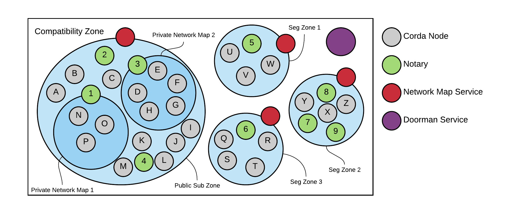

---
aliases:
- /releases/release-1.0/sub-zones.html
date: '2020-01-08T09:59:25Z'
menu:
- cenm-1-0
tags:
- zones
title: Sub Zones
---

# Sub Zones


This is an internal feature. Running a network with multiple sub-zones is not a supported configuration.



## From a Node’s Perspective

From the perspective of a node a compatibility zone is defined by the Identity Manager and Network Map services it is
                configured to connect to. It has no comprehension of sub zones. It simply connects to the services configured within its
                configuration file and, once registered with both, interacts with other nodes and the apps deployed upon it via the
                RPC clients. This is summarised below:

The node is unaware of other sub zones, seeing only those nodes registered with the network map service it itself has
                registered with.

## From the Perspective of the Zone

From the perspective of the operator of that zone however, things are a lot more interesting:


Signing infrastructure is omitted for brevity


In this example the zone operator is operating two public sub zones, each with a different min platform version (the
                other network parameters shared by the two zones are omitted for brevity). Each sub zone has a single notary, operated
                by the zone operator, whose nodeInfo is included in the whitelist of the network parameters representing that zone.

Interesting features

* All nodes are registered with the zone’s Identity Manager service. *(This includes the notaries)*

* Each sub zone is represented by a network map, each with its own database and network parameters file

* Node 1 is on the “older” sub zone using a minimum platform version of 3, it is unaware Nodes 2 and 3 even exist
                        (just as they are unaware of it) but can use Notary 1.

* Nodes 2 and 3 and Notary 2 can all intercommunicate as one would expect

## Segregated Sub Zones

The fundamental difference between a public sub zone and a segregated one is the operation of the notaries is
                deferred to a third party.


The relationship between the zone operator and the notary operator is left to the discretion
                    of the zone operator. The important part from the perspective of the ENM is that the signed Node Info
                    is transferred from the notary operator to the zone operator.


This is shown in the following diagram:

## Sub Zones vs Private Network Maps

Private Network Maps, see [Private Network Map](private-network-map.md), differ from sub zones in several fundamental ways. Indeed, there
                is nothing to prevent the two features being deployed along side one another to address the differing needs of a zones
                members.

An example Compatibility Zone, with several Private Network Maps and Sub Zones, both public and segregated, is shown
                below:

The Compatibility Zone in our example has

* 1 Identity Manager Service

* 4 Network Map Services

* 1 Public Sub Zone

    * 4 Notaries

    * This Zone has 2 Private Network Maps

        * PNM 1 has 3 Nodes and 1 Notary shared with the public Network Map

        * PNM 2 has 5 Nodes and 1 Notary shared with the public Network Map

* 3 Segregated Sub Zones

    * Seg Zone 1 has a single Notary and 3 Nodes

    * Seg Zone 2 has 3 Notaries and 3 Nodes

    * Seg Zone 3 has a single Notary and 5 Nodes

Notaries used by a Private Network Map are still available to the rest of the Sub Zone to which they belong whilst
                notaries running as part of a Seg Zone can only be used by the nodes within that Zone. Each Sub Zone *must* have
                its own Network Map Service, whilst the Zone as a whole has a single Identity Manager service.

Members of a zone are completely unaware of any node outside of the zone to which they have joined.



## Which Nodes can communicate with one another.

|Node|Notary|Other Nodes|
|-----|----------|-------------------|
|A|1, 2, 3, 4|B, C, I, J, K, L, M|
|B|1, 2, 3, 4|A, C, I, J, K, L, M|
|C|1, 2, 3, 4|A, B, I, J, K, L, M|
|D|3|E, F, G, H|
|E|3|D, F, G, H|
|F|3|D, E, G, H|
|G|3|D, E, F, H|
|H|3|D, E, F, G|
|I|1, 2, 3, 4|A, B, C, J, K, L, M|
|J|1, 2, 3, 4|A, B, C, I, K, L, M|
|K|1, 2, 3, 4|A, B, C, I, J, L, M|
|L|1, 2, 3, 4|A, B, C, Im J, K, M|
|M|1, 2, 3, 4|A, B, C, I, J, K, L|
|N|1|O, P|
|O|1|N, P|
|P|1|N, O|
|Q|6|R, S, T|
|R|6|Q, S, T|
|S|6|Q, R, T|
|T|6|Q, R, S|
|U|5|V, W|
|V|5|U, W|
|W|5|U, V|
|X|7, 8, 9|Y, Z|
|Y|7, 8, 9|X, Y|


We can also picture the Zone in terms of which Notary will notarise transactions for which nodes



## Notary will notarise transactions for

|Notary|Nodes|
|------|-------------------------------------|
|1|A, B, C, I, J, K, L, M, N, O, P|
|2|A, B, C, I, J, K, L, M|
|3|A, B, C, D, E, F, G, H, I, J, K, L, M|
|4|A, B, C, I, J, K, L, M|
|5|U, V, W|
|6|Q, R, S, T|
|7|X, Y, Z|
|8|X, Y, Z|
|9|X, Y, Z|



