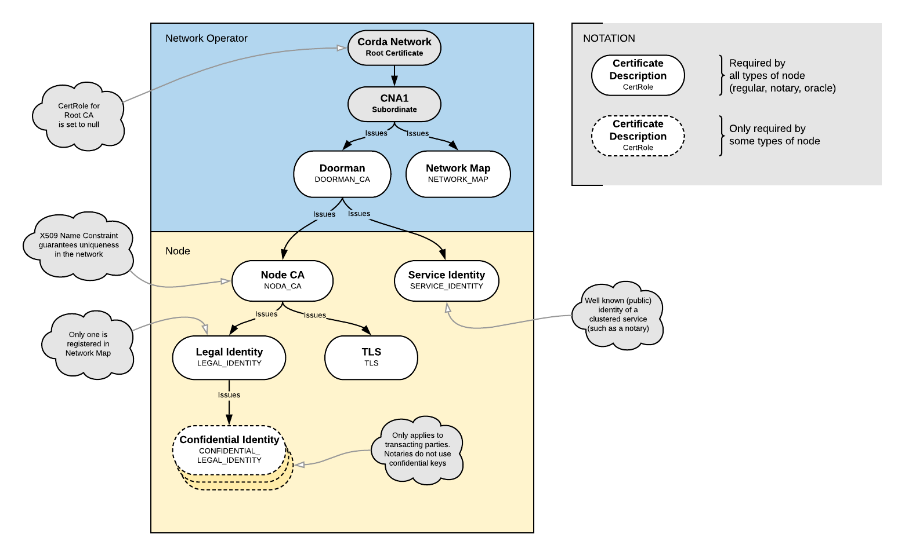

# Cipher suites supported by Corda

The set of signature schemes supported forms a part of the consensus rules for a Corda DLT network.
            Thus, it is important that implementations do not support pluggability of any crypto algorithms and do take measures
            to prevent algorithms supported by any underlying cryptography library from becoming accidentally accessible.
            Signing a transaction with an algorithm that is not a part of the base specification would result in a transaction
            being considered invalid by peer nodes and thus a loss of consensus occurring. The introduction of new algorithms
            over time will require a global upgrade of all nodes.

Corda has been designed to be cryptographically agile, in the sense that the available set of signature schemes is
            carefully selected based on various factors, such as provided security-level and cryptographic strength, compatibility
            with various HSM vendors, algorithm standardisation, variety of cryptographic primitives, business demand, option for
            post-quantum resistance, side channel security, efficiency and rigorous testing.

Before we present the pool of supported schemes it is useful to be familiar with [Network certificates](permissioning.md)
            and [API: Identity](api-identity.md). An important design decision in Corda is its shared hierarchy between the
            TLS and Node Identity certificates.

## Certificate hierarchy

A Corda network has 8 types of keys and a regular node requires 4 of them:

**Network Keys**

* The **root network CA** key

* The **doorman CA** key

* The **network map** key

* The **service identity** key(s) (per service, such as a notary cluster; it can be a Composite key)

**Node Keys**

* The **node CA** key(s) (one per node)

* The **legal identity** key(s) (one per node)

* The **tls** key(s) (per node)

* The **confidential identity** key(s) (per node)

We can visualise the certificate structure as follows (for a detailed description of cert-hierarchy,
                see [Network certificates](permissioning.md)):

## Supported cipher suites

Due to the shared certificate hierarchy, the following 4 key/certificate types: **root network CA**, **doorman CA**,
                **node CA** and **tls** should be compatible with the standard TLS 1.2 protocol. The latter is a requirement from the
                TLS certificate-path validator. It is highlighted that the rest of the keys can be any of the 5 supported cipher suites.
                For instance, **network map** is ECDSA NIST P-256 (secp256r1) in the Corda Network (CN) as it is well-supported by the
                underlying HSM device, but the default for dev-mode is Pure EdDSA (ed25519).

The following table presents the 5 signature schemes currently supported by Corda. The TLS column shows which of them
                are compatible with TLS 1.2, while the default scheme per key type is also shown in the last column.



|Cipher suite|Description|TLS|Default for|
|-------------------------|---------------------------------------------------------------|-----|-------------------------|
|
Pure EdDSA using theed25519 curveand SHA-512|
EdDSA represents the current state of the art in mainstreamcryptography. It implements elliptic curve cryptographywith deterministic signatures a fast implementation,explained constants, side channel resistance and many otherdesirable characteristics. However, it is relatively newand not widely supported, for example, you can’t use it inTLS yet (a draft RFC exists but is not standardised yet).|NO|
* node identity

* confidential identity

* network map (dev)

|
|
ECDSA using theNIST P-256 curve(secp256r1)and SHA-256|
This is the default choice for most systems that supportelliptic curve cryptography today and is recommended byNIST. It is also supported by the majority of the HSMvendors.|YES|
* root network CA

* doorman CA

* node CA

* tls

* network map (CN)

|
|
ECDSA using theKoblitz k1 curve(secp256k1)and SHA-256|
secp256k1 is the curve adopted by Bitcoin and as such thereis a wealth of infrastructure, code and advanced algorithmsdesigned for use with it. This curve is standardised byNIST as part of the “Suite B” cryptographic algorithms andas such is more widely supported than ed25519. Bysupporting it we gain access to the ecosystem of advancedcryptographic techniques and devices pioneered by theBitcoin community.|NO||
|
RSA (3072bit) PKCS#1and SHA-256|
RSA is well supported by any sort of hardware or softwareas a signature algorithm no matter how old, for example,legacy HSMs will support this along with obsolete operatingsystems. RSA is using bigger keys than ECDSA and thus it isrecommended for inclusion only for its backwardscompatibility properties, and only for usage where legacyconstraints or government regulation forbids the usage ofmore modern approaches.|YES||
|
SPHINCS-256and SHA-512(experimental)|
SPHINCS-256 is a post-quantum secure algorithm that reliesonly on hash functions. It is included as a hedge againstthe possibility of a malicious adversary obtaining aquantum computer capable of running Shor’s algorithm infuture. SPHINCS is based ultimately on a clever usage ofMerkle hash trees. Hash functions are a very heavilystudied and well understood area of cryptography. Thus, itis assumed that there is a much lower chance ofbreakthrough attacks on the underlying mathematicalproblems. However, SPHINCS uses relatively big public keys,it is slower and outputs bigger signatures than EdDSA,ECDSA and RSA algorithms.|NO||



