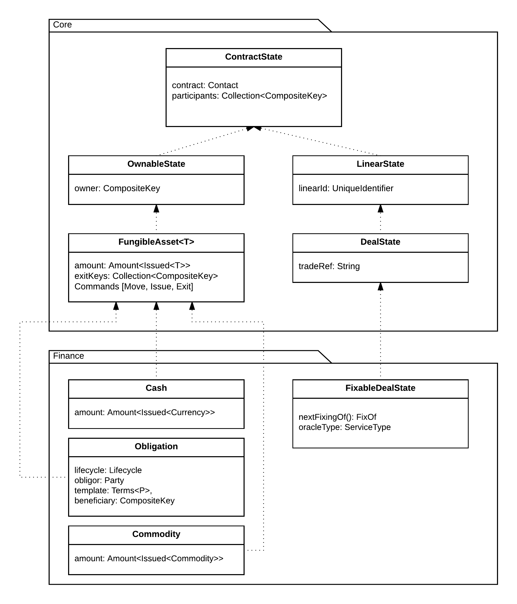

---
aliases:
- /releases/4.4/financial-model.html
date: '2020-01-08T09:59:25Z'
menu:
- corda-enterprise-4-4
tags:
- financial
- model
title: Financial model
---


# Financial model

Corda provides a large standard library of data types used in financial applications and contract state objects.
            These provide a common language for states and contracts.


## Amount

The [Amount](api/kotlin/corda/net.corda.core.contracts/-amount/index.html) class is used to represent an amount of
                some fungible asset. It is a generic class which wraps around a type used to define the underlying product, called
                the *token*. For instance it can be the standard JDK type `Currency`, or an `Issued` instance, or this can be
                a more complex type such as an obligation contract issuance definition (which in turn contains a token definition
                for whatever the obligation is to be settled in). Custom token types should implement `TokenizableAssetInfo` to allow the
                `Amount` conversion helpers `fromDecimal` and `toDecimal` to calculate the correct `displayTokenSize`.



Fungible is used here to mean that instances of an asset is interchangeable for any other identical instance,
                    and that they can be split/merged. For example a £5 note can reasonably be exchanged for any other £5 note, and
                    a £10 note can be exchanged for two £5 notes, or vice-versa.


Here are some examples:





{}
```kotlin
// A quantity of some specific currency like pounds, euros, dollars etc.
Amount<Currency>
// A quantity of currency that is issued by a specific issuer, for instance central bank vs other bank dollars
Amount<Issued<Currency>>
// A quantity of a product governed by specific obligation terms
Amount<Obligation.Terms<P>>
```
{}


`Amount` represents quantities as integers. You cannot use `Amount` to represent negative quantities,
                or fractional quantities: if you wish to do this then you must use a different type, typically `BigDecimal`.
                For currencies the quantity represents pennies, cents, or whatever else is the smallest integer amount for that currency,
                but for other assets it might mean anything e.g. 1000 tonnes of coal, or kilowatt-hours. The precise conversion ratio
                to displayable amounts is via the `displayTokenSize` property, which is the `BigDecimal` numeric representation of
                a single token as it would be written. `Amount` also defines methods to do overflow/underflow checked addition and subtraction
                (these are operator overloads in Kotlin and can be used as regular methods from Java). More complex calculations should typically
                be done in `BigDecimal` and converted back to ensure due consideration of rounding and to ensure token conservation.

`Issued` refers to a product (which can be cash, a cash-like thing, assets, or generally anything else that’s
                quantifiable with integer quantities) and an associated `PartyAndReference` that describes the issuer of that contract.
                An issued product typically follows a lifecycle which includes issuance, movement and exiting from the ledger (for example,
                see the `Cash` contract and its associated *state* and *commands*)

To represent movements of `Amount` tokens use the `AmountTransfer` type, which records the quantity and perspective
                of a transfer. Positive values will indicate a movement of tokens from a `source` e.g. a `Party`, or `CompositeKey`
                to a `destination`. Negative values can be used to indicate a retrograde motion of tokens from `destination`
                to `source`. `AmountTransfer` supports addition (as a Kotlin operator, or Java method) to provide netting
                and aggregation of flows. The `apply` method can be used to process a list of attributed `Amount` objects in a
                `List<SourceAndAmount>` to carry out the actual transfer.


## Financial states

In additional to the common state types, a number of interfaces extend `ContractState` to model financial state such as:

> 
> 
> 
> `LinearState`
> A state which has a unique identifier beyond its StateRef and carries it through state transitions.
>                                 Such a state cannot be duplicated, merged or split in a transaction: only continued or deleted. A linear state is
>                                 useful when modelling an indivisible/non-fungible thing like a specific deal, or an asset that can’t be
>                                 split (like a rare piece of art).
> 
> 
> `DealState`
> A LinearState representing an agreement between two or more parties. Intended to simplify implementing generic
>                                 protocols that manipulate many agreement types.
> 
> 
> `FungibleAsset`
> A FungibleAsset is intended to be used for contract states representing assets which are fungible, countable and issued by a
>                                 specific party. States contain assets which are equivalent (such as cash of the same currency), so records of their existence
>                                 can be merged or split as needed where the issuer is the same. For instance, dollars issued by the Fed are fungible and
>                                 countable (in cents), barrels of West Texas crude are fungible and countable (oil from two small containers can be poured into one large
>                                 container), shares of the same class in a specific company are fungible and countable, and so on.

The following diagram illustrates the complete Contract State hierarchy:

Note there are currently two packages, a core library and a finance model specific library.
                Developers may re-use or extend the Finance types directly or write their own by extending the base types from the Core library.


