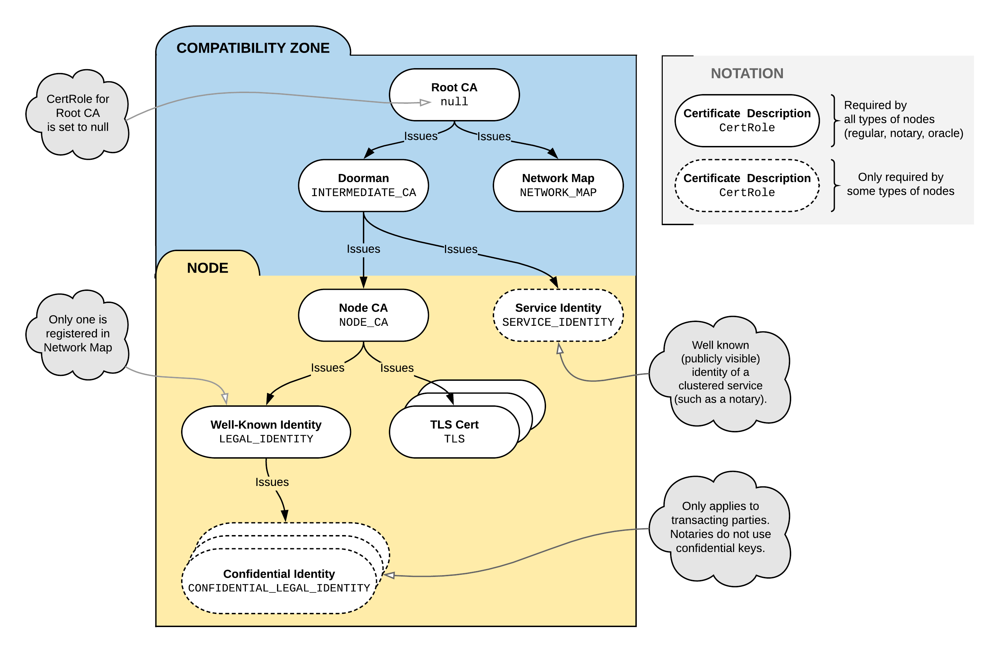

---
aliases:
- /releases/release-V4.0/permissioning.html
date: '2020-01-08T09:59:25Z'
menu: []
tags:
- permissioning
title: Network certificates
---

# Network certificates

## Certificate hierarchy

A Corda network has three types of certificate authorities (CAs):

* The **root network CA** that defines the extent of a compatibility zone
* The **doorman CA** that is used instead of the root network CA for day-to-day key signing to reduce the risk of the root
network CA’s private key being compromised. This is equivalent to an intermediate certificate in the web PKI
* Each node also serves as its own CA, issuing the child certificates that it uses to sign its identity keys and TLS
certificates

Each certificate contains an X.509 extension that defines the certificate/key’s role in the system (see below for details).
It also uses X.509 name constraints to ensure that the X.500 names that encode human meaningful identities are propagated
to all the child certificates properly. The following constraints are imposed:

* Doorman certificates are issued by a network root. Network root certs do not contain a role extension
* Node certificates are signed by a doorman certificate (as defined by the extension)
* Legal identity/TLS certificates are issued by a certificate marked as node CA
* Confidential identity certificates are issued by a certificate marked as well known legal identity
* Party certificates are marked as either a well known identity or a confidential identity

The structure of certificates above the doorman/network map is intentionally left untouched, as they are not relevant to
the identity service and therefore there is no advantage in enforcing a specific structure on those certificates. The
certificate hierarchy consistency checks are required because nodes can issue their own certificates and can set
their own role flags on certificates, and it’s important to verify that these are set consistently with the
certificate hierarchy design. As a side-effect this also acts as a secondary depth restriction on issued
certificates.

We can visualise the permissioning structure as follows:

## Key pair and certificate formats

The required key pairs and certificates take the form of the following Java-style keystores (this may change in future to
support PKCS#12 keystores) in the node’s `<workspace>/certificates/` folder:

* `network-root-truststore.jks`, the network/zone operator’s root certificate as provided by them with a standard password. Can be deleted after initial registration
* `truststore.jks`, the network/zone operator’s root certificate in keystore with a locally configurable password as protection against certain attacks
* `nodekeystore.jks`, which stores the node’s identity key pairs and certificates
* `sslkeystore.jks`, which stores the node’s TLS key pair and certificate

The key pairs and certificates must obey the following restrictions:

* The certificates must follow the [X.509v3 standard](https://tools.ietf.org/html/rfc5280)
* The TLS certificates must follow the [TLS v1.2 standard](https://tools.ietf.org/html/rfc5246)
* The root network CA, doorman CA, and node CA keys, as well as the node TLS keys, must follow one of the following schemes:> 
> 
> * ECDSA using the NIST P-256 curve (secp256r1)
> * ECDSA using the Koblitz k1 curve (secp256k1)
> * RSA with 3072-bit key size or higher

* The node CA certificates must have the basic constraints extension set to true
* The TLS certificates must have the basic constraints extension set to false

## Certificate role extension

Corda certificates have a custom X.509v3 extension that specifies the role the certificate relates to. This extension
has the OID `1.3.6.1.4.1.50530.1.1` and is non-critical, so implementations outside of Corda nodes can safely ignore it.
The extension contains a single ASN.1 integer identifying the identity type the certificate is for:

* Doorman
* Network map
* Service identity (currently only used as the shared identity in distributed notaries)
* Node certificate authority (from which the TLS and well-known identity certificates are issued)
* Transport layer security
* Well-known legal identity
* Confidential legal identity

In a typical installation, node administrators need not be aware of these. However, if node certificates are to be
managed by external tools, such as those provided as part of an existing PKI solution deployed within an organisation,
it is important to recognise these extensions and the constraints noted above.

Certificate path validation is extended so that a certificate must contain the extension if the extension was present
in the certificate of the issuer.

