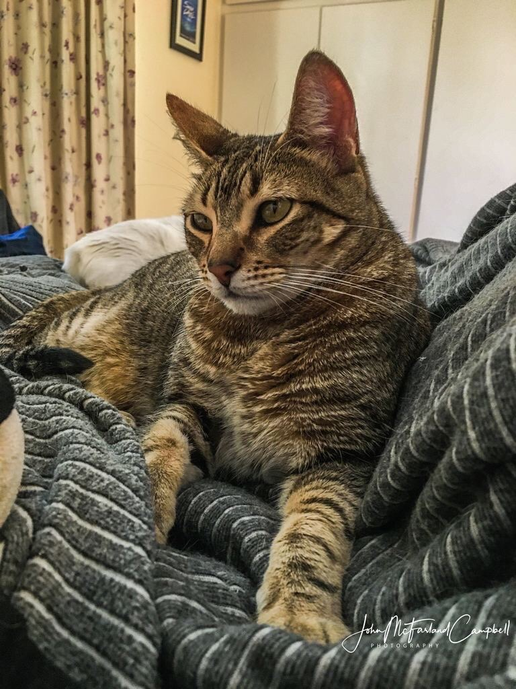

# `figure` shortcode test

{}

## Main as standard Markdown

## Zoom image as standard Markdown

## `figure` - with `src`, `zoom`, and `figcaption`

{}

## `figure` - with `zoom`, and `figcaption`

{}

## `figure` - with `src`, and `figcaption`

{}

## `figure` - with `src`, and `zoom`

{}

## `figure` - with `zoom`

{}

## `figure` - with `src`

{}

## `figure` - without named params

Please don't ever do this in production.

{}
### 